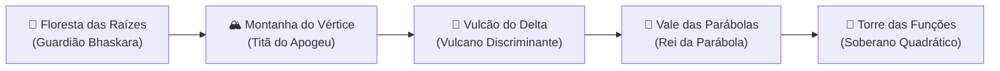

<div align="center">

# ⚔️ Batalha das Funções — RPG Matemático do 2º Grau

### *Domine a Álgebra, Desperte Criaturas e Torne-se o Mestre Supremo da Parábola!*

<p align="center">
  
</p>

[](https://react.dev/)
[](https://www.typescriptlang.org/)
[](https://vitejs.dev/)
[](https://tailwindcss.com/)
[](#-áudio-e-trilha-sonora)
[](#-salvamento-em-nuvem--offline)
[](#-alinhamento-pedagógico-bncc)

---

[📖 Sobre](#-sobre-o-jogo) •
[✨ Destaques](#-principais-recursos) •
[🐾 Criaturas](#-criaturas-iniciais--evoluções) •
[🗺️ Regiões & Chefes](#-o-mapa-do-reino--regiões-e-chefes) •
[⚔️ Sistema de Batalha](#️-mecânicas-de-combate--precisão-matemática) •
[🎮 Modos de Jogo](#-modos-de-jogo) •
[🛠️ Ferramentas In-Game](#️-ferramentas-auxiliares-do-algebrista) •
[🚀 Como Rodar](#-como-executar-o-projeto) •
[📚 BNCC](#-alinhamento-pedagógico-bncc)

---

</div>

<br />

## 🌟 Sobre o Jogo

**Batalha das Funções** é um RPG tático em turnos em estilo pixel art retrô que transforma o aprendizado da **Função Quadrática (2º Grau)** em uma experiência gamificada, empolgante e intuitiva.

No universo de **Equacionária**, o equilíbrio matemático foi corrompido por entidades desestabilizadoras. Apenas treinadores capazes de calcular coeficientes, encontrar raízes através de Bhaskara, desvendar o discriminante $\Delta$ e localizar os pontos de máximo e mínimo nos vértices parabólicos poderão restaurar a harmonia dos planos cartesianos.

> *"A matemática deixa de ser abstrata quando cada cálculo certeiro desfere um golpe crítico contra os guardiões da desordem!"*

---

## ✨ Principais Recursos

- 👾 **Batalhas em Turnos com Precisão Matemática**: A força do seu golpe é calculada com base na exatidão da sua resposta matemática (com tolerância inteligente e feedback imediato).
- 🧬 **Sistema de Evolução em 3 Estágios**: Suas criaturas ganham experiência, sobem de nível e evoluem visualmente e estatisticamente.
- 🔥 **4 Elementos Temáticos Algébricos**: Raízes, Vértice, Delta e Parábola.
- 🗺️ **Modo Aventura com 5 Grandes Reinos**: Explore florestas, montanhas e vulcões, enfrentando sentinelas até os chefes supremos.
- 📈 **Gráfico Dinâmico da Parábola em Tempo Real**: Visualize curvas cartesianas interativas, raízes $x_1, x_2$, vértice $(X_v, Y_v)$ e concavidade.
- 🧮 **Utilitários do Algebrista**: Mini calculadora integrada e bloco de rascunho rápido para você resolver as contas sem sair do jogo.
- 📖 **Grimório / Codex Matemático**: Enciclopédia teórica viva com explicações passo a passo, fórmulas comentadas e dicas para cada conceito.
- ☁️ **Salvamento em Nuvem via Google Drive**: Guarde e sincronize seu progresso em qualquer dispositivo, além de backup local instantâneo.
- 🎵 **Trilha & Efeitos Sonoros Chiptune**: Sintetizador retro dinâmico construído inteiramente com a *Web Audio API*.

---

## 🐾 Criaturas Iniciais & Evoluções

Escolha seu monstrinho inicial e trilhe uma jornada de aprimoramento e evolução:

| Criatura | Elemento | Foco Matemático | Linha Evolutiva | Habilidade Suprema |
| :---: | :---: | :---: | :---: | :---: |
| 🌿 **Raizmon** | **Raízes** | Bhaskara e Fatoração | `Raizmon` ➔ `Raizel` ➔ `Radimax` | *Apocalipse Quadrático* |
| 💧 **Vertix** | **Vértice** | Extremos e Simetria | `Vertix` ➔ `Vertigonix` ➔ `Vertexar` | *Vórtice do Vértice* |
| 🔥 **X-mander** | **Delta** | Discriminante ($\Delta$) | `X-mander` ➔ `X-meleon` ➔ `X-lizard` | *Explosão Térmica do Delta* |
| 🔮 **Curvagon** | **Parábola** | Concavidade e Gráficos | `Curvagon` ➔ Formas Superiores | *Corte Cartesiano* |

Cada criatura conta com atributos dinâmicos: **HP**, **Energia**, **Ataque**, **Defesa**, **Velocidade** e um arsenal de golpes categorizados em *Ofensivos*, *Defensivos*, *Suporte* e *Supremos*.

---

## 🗺️ O Mapa do Reino — Regiões e Chefes

Embarque em uma expedição progressiva por 5 regiões mapeadas:



| Região | Foco Teórico | Sentinelas | Chefe Guardião |
| :--- | :--- | :--- | :--- |
| 🌲 **Floresta das Raízes** | Raízes reais, $f(x)$ numérico, concavidade | Raiz Silvestre, Fatorino Ágil | **Guardião Bhaskara** |
| 🏔️ **Montanha do Vértice** | Coordenadas $X_v$ e $Y_v$, máximos e mínimos | Sentinela do Eixo, Golem Simétrico | **Titã do Apogeu** |
| 🌋 **Vulcão do Delta** | $\Delta > 0$, $\Delta = 0$, $\Delta < 0$, discriminante | Fagulha Discriminante, Salamandra | **Vulcano Discriminante** |
| 🌌 **Vale das Parábolas** | Ponto de corte $C(0, c)$, eixo de simetria | Espectro Cartesiano, Ilusão de Gauss | **Rei da Parábola** |
| 🏰 **Torre das Funções** | Desafios supremos combinando todos os conceitos | Arquimago Algébrico, Avatar Polinomial | **Soberano Quadrático** |

---

## ⚔️ Mecânicas de Combate & Precisão Matemática

A mecânica de combate elimina o mero "acaso" e premia o raciocínio analítico:

```
[Seleção de Habilidade] ➔ [Desafio Matemático Gerado] ➔ [Análise de Tolerância & Precisão] ➔ [Cálculo do Dano]
```

### Classificação de Precisão:
- 🌟 **PERFEITO (100% de Acerto)**: Multiplicador de dano **1.5x ~ 2.0x**, ganho extra de energia e continuidade de Combo!
- 🟢 **ALTA PRECISÃO**: Multiplicador **1.2x**.
- 🟡 **MÉDIA PRECISÃO**: Dano base normal (1.0x).
- 🟠 **BAIXA PRECISÃO**: O golpe atinge com raspão (0.5x).
- ❌ **FALHA**: O ataque erra o alvo e consome energia.

### Sistema de Dicas Gradativas:
Travou na questão? Não desista! O sistema oferece 3 níveis de ajuda pedagógica:
1. 💡 **Dica 1 — Conceitual**: Apresenta a fórmula essencial a ser empregada.
2. 🔍 **Dica 2 — Substituição**: Insere os valores de $a$, $b$ e $c$ da função na fórmula.
3. 📝 **Dica 3 — Resolução Parcial**: Detalha o caminho algébrico até a resposta final.

---

## 🎮 Modos de Jogo

### 🗺️ Modo Aventura
A campanha principal. Avance pelas trilhas do mapa cartesiano, desbloqueie estágios, acumule estrelas, suba de nível e confronte chefes lendários.

### 🎯 Modo Treino
Área livre dedicada ao estudo. Escolha o conceito matemático específico que deseja praticar (ex.: apenas cálculo de Vértice ou discriminante $\Delta$), ajuste a dificuldade e treine no seu ritmo.

### ⚡ Modo Desafio
Uma corrida eletrizante contra o relógio! Resolva a maior quantidade de equações em sequência para acumular combos, quebrar recordes e receber recompensas raras.

### 🛍️ Empório & Loja de Itens
Troque as moedas obtidas em batalha por suprimentos:
- 🧪 **Poções de Vida (HP)**: Cura básica e super poções.
- ⚡ **Frascos de Éter/Energia**: Recarga para habilidades supremas.
- 🛡️ **Tônicos de Foco e Elixires**: Ampliam precisão e multiplicadores de combate.

---

## 🛠️ Ferramentas Auxiliares do Algebrista

O jogo foi construído como um laboratório completo de aprendizagem ativa:

- 📈 **Visualizador Interativo de Parábola (`ParabolaGraph`)**: Renderização gráfica canvas/SVG da função ativa, destacando raízes, concavidade e vértice em tempo real.
- 🧮 **Mini Calculadora Digital (`MiniCalculator`)**: Realize potenciações, divisões e raízes quadradas sem alternar de janela.
- 📝 **Bloco de Rascunho Rápido (`QuickNotepad`)**: Anote variáveis, valores parciais de delta e rascunhos de cálculo durante a batalha.
- 📖 **Grimório Matemático (`CodexGrimoire`)**: Acesso instantâneo a um guia com a teoria das funções quadráticas, gráficos comentados e exemplos práticos.

---

## ☁️ Salvamento em Nuvem & Offline

Seus dados e monstros nunca se perdem:
- **Armazenamento Local Automático**: Salva estágio, moedas, itens e criatura no `localStorage`.
- **Nuvem Google Drive (OAuth 2.0)**: Sincronize seus dados em um arquivo seguro no seu próprio Google Drive (`batalha_funcoes_save.json`), permitindo continuar o jogo na escola, em casa ou no celular!

---

## 🎵 Áudio e Trilha Sonora

O jogo possui um motor de áudio dedicado com síntese chiptune em tempo real:
- 🔊 Efeitos sonoros para acertos críticos, golpes elementais, cliques retrô e fanfarra de vitória.
- 🎶 Trilha de fundo imersiva em estilo 8-bit com controles completos de volume e mudo.

---

## 💻 Tecnologias Empregadas

<div align="center">

| Categoria | Tecnologia | Finalidade |
| :--- | :--- | :--- |
| **Frontend Core** | [React 19](https://react.dev/) | Renderização reativa de interfaces e componentes modulares |
| **Linguagem** | [TypeScript 5.8](https://www.typescriptlang.org/) | Tipagem estrita de criaturas, fórmulas, desafios e estados |
| **Bundler & Build** | [Vite 6](https://vitejs.dev/) | Empacotamento veloz e ambiente de desenvolvimento ultrarrápido |
| **Estilização** | [TailwindCSS 4](https://tailwindcss.com/) | Design responsivo, paleta temática e efeitos de glassmorphism |
| **Animações** | [Motion](https://motion.dev/) | Transições fluidas de tela, entradas de sprites e diálogos |
| **Ícones** | [Lucide React](https://lucide.dev/) | Ícones vetoriais modernos e expressivos |
| **Efeitos Visuais** | [Canvas Confetti](https://www.npmjs.com/package/canvas-confetti) | Celebração de vitórias e evoluções |
| **Áudio** | [Web Audio API](https://developer.mozilla.org/en-US/docs/Web/API/Web_Audio_API) | Sintetizador procedural de áudio 8-bit sem arquivos pesados |
| **Cloud Storage** | [Google Drive API](https://developers.google.com/drive) | Sincronização em nuvem segura para o estudante |

</div>

---

## 📂 Estrutura do Projeto

```plaintext
Batalha-das-Fun-es/
├── public/                 # Favicons e ativos estáticos públicos
├── src/
│   ├── components/         # Componentes modulares da interface
│   │   ├── BattleScene.tsx         # Arena principal de combate em turnos
│   │   ├── CombatHUD.tsx           # Barras de HP, Energia e status
│   │   ├── MathDialogueBox.tsx     # Diálogo de questões, input e 3 níveis de dicas
│   │   ├── MapView.tsx             # Mapa interativo com as 5 regiões
│   │   ├── StarterSelection.tsx    # Tela de escolha da criatura inicial
│   │   ├── EvolutionModal.tsx      # Cinemática de evolução dos monstros
│   │   ├── TrainingMode.tsx        # Modo de prática livre por conteúdo
│   │   ├── ChallengeMode.tsx       # Modo contra o relógio e combos
│   │   ├── ShopView.tsx            # Empório de poções e itens de suporte
│   │   ├── CodexGrimoire.tsx       # Bestiário e enciclopédia matemática
│   │   ├── ParabolaGraph.tsx       # Gráfico cartesiano interativo
│   │   ├── MiniCalculator.tsx      # Calculadora auxiliar flutuante
│   │   ├── QuickNotepad.tsx        # Bloco de rascunhos para contas
│   │   ├── GoogleDriveSaveModal.tsx# Sincronização com o Google Drive
│   │   └── InteractiveOnboarding.tsx # Tutorial para novos algebristas
│   ├── data/               # Banco de dados e configurações do jogo
│   │   ├── creatures.ts            # Criaturas, formas, atributos e habilidades
│   │   ├── regions.ts              # Regiões, fases, chefes e requisitos
│   │   ├── items.ts                # Itens consumíveis da loja
│   │   └── spritePresets.ts        # Presets e configurações visuais
│   ├── services/           # Integrações externas
│   │   ├── driveAuth.ts            # Fluxo OAuth e autenticação Google
│   │   └── driveStorage.ts         # Leitura e escrita de saves na nuvem
│   ├── utils/              # Funções utilitárias e motores de jogo
│   │   ├── mathEngine.ts           # Gerador procedural de desafios e cálculo de precisão
│   │   ├── audio.ts                # Sintetizador procedural Web Audio API
│   │   ├── iconMap.tsx             # Mapeamento dinâmico de ícones
│   │   └── spritePreloader.ts      # Pré-carregamento assíncrono de sprites
│   ├── types.ts            # Definições de tipos TypeScript do sistema
│   ├── App.tsx             # Roteamento e orquestrador de estado global
│   ├── main.tsx            # Ponto de entrada React
│   └── index.css           # Estilos globais e fontes retrô
├── index.html              # Template HTML com fontes (Press Start 2P, VT323)
├── package.json            # Dependências e scripts npm
├── tsconfig.json           # Configuração do TypeScript
└── vite.config.ts          # Configuração do Vite
```

---

## 🚀 Como Executar o Projeto

### Pré-requisitos
- [Node.js](https://nodejs.org/) (versão 18 ou superior)
- Gerenciador de pacotes: `npm`, `yarn` ou `bun`

### Passo a Passo

1. **Clone o repositório:**
   ```bash
   git clone https://github.com/seu-usuario/Batalha-das-Fun-es.git
   cd Batalha-das-Fun-es
   ```

2. **Instale as dependências:**
   ```bash
   npm install
   ```

3. **Inicie o servidor de desenvolvimento:**
   ```bash
   npm run dev
   ```

4. **Abra no seu navegador:**
   O terminal indicará a porta local, normalmente:
   ```
   http://localhost:3000
   ```

### Scripts Disponíveis

- `npm run dev`: Executa a aplicação em modo de desenvolvimento com Hot Reload.
- `npm run build`: Gera a versão otimizada para produção na pasta `dist/`.
- `npm run preview`: Visualiza localmente o build de produção.
- `npm run lint`: Checagem de tipagem com TypeScript (`tsc --noEmit`).

---

## 📚 Alinhamento Pedagógico (BNCC)

O jogo foi desenhado em total conformidade com as diretrizes da **Base Nacional Comum Curricular (BNCC)** para o 9º ano do Ensino Fundamental e Ensino Médio:

- **(EF09MA06)**: Compreender as funções a partir de representações algébricas e geométricas, associando a função polinomial de 2º grau à sua representação gráfica (parábola).
- **(EM13MAT502)**: Investigar relações entre números e suas representações em gráficos, analisando máximos e mínimos em situações-problema.
- **Competências Gerais**: Estímulo ao pensamento computacional, raciocínio lógico-dedutivo, resolução autônoma de problemas e resiliência diante do erro por meio de feedbacks formativos imediatos.

---

## 🤝 Como Contribuir

Contribuições são super bem-vindas! Se você deseja adicionar novos desafios, monstros, habilidades ou melhorias visuais:

1. Faça um **Fork** do projeto.
2. Crie uma Branch para sua feature:
   ```bash
   git checkout -b feature/NovaCriatura
   ```
3. Faça o commit das suas alterações:
   ```bash
   git commit -m "feat: adiciona nova criatura do elemento Parábola"
   ```
4. Envie para o repositório remoto:
   ```bash
   git push origin feature/NovaCriatura
   ```
5. Abra um **Pull Request**.

---

## 📄 Licença

Este projeto está sob a licença **MIT**. Consulte o arquivo `LICENSE` para mais informações.

<br />

<div align="center">

**Criado com 💜 e Álgebra por Educadores & Desenvolvedores Apaixonados por Jogos.**

*Que o Discriminante esteja sempre a seu favor!* 📐✨

</div>
